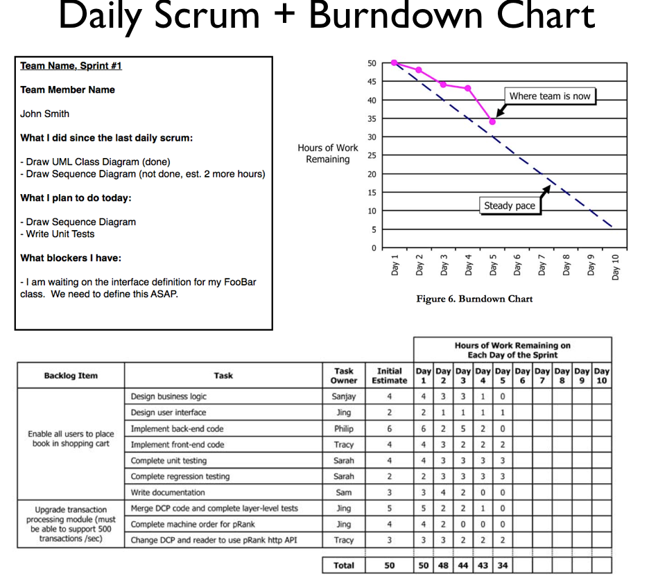

# CMPE 202 - Project - Team Hackathon

- Maintain a **Scrum Task Board (using GitHub Project Board)**

- - You should have at least 2 User Stories per team member on the Board
  - One of the stories should be a Technical Story for Design Pattern
  - The second story should be about a feature in the Game

- Example to be updated: 

