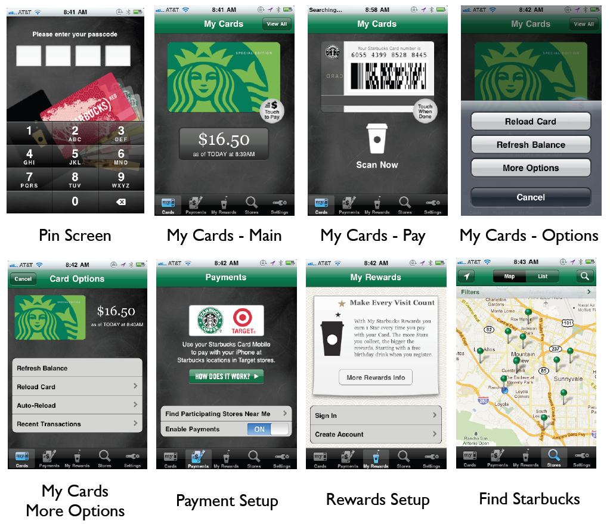
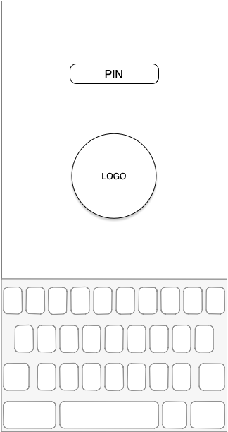
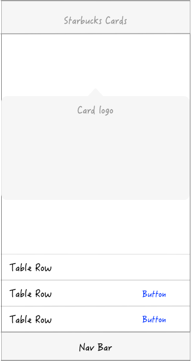
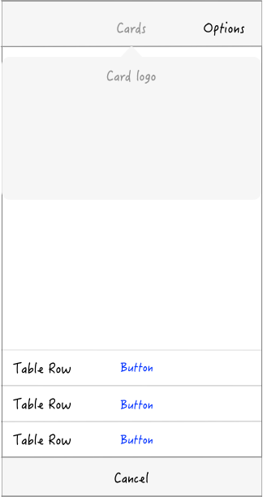
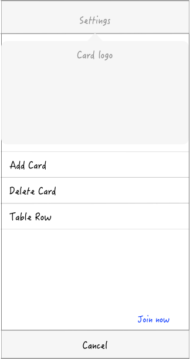
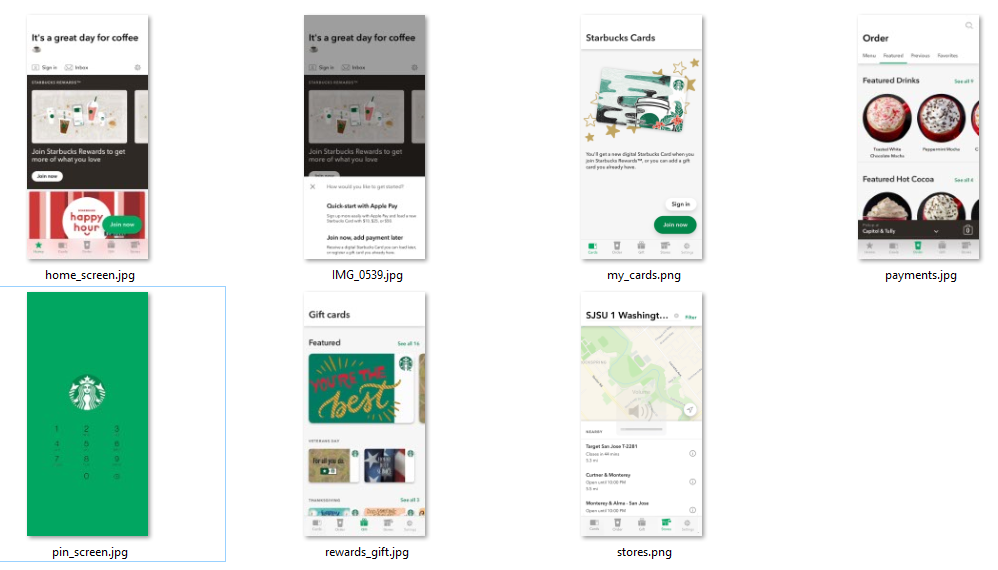

# CMPE 202 - Project - Team Hackathon

- Create **UI Wireframes**

- - Create UI wireframes for each of the screen in your team’s solution
  - (this can be done by hand or electronically with a tool like “Pencil”)

## App screens
We re-used the UI from professor at the individual project. 

## App geometry conversion between versions
We have applied strategy pattern to switch between versions for converting the geometry.

## Wireframes for future version
We have also explored to use the latest Starbuck mobile app screen in the future version. 

## App screens for future version

