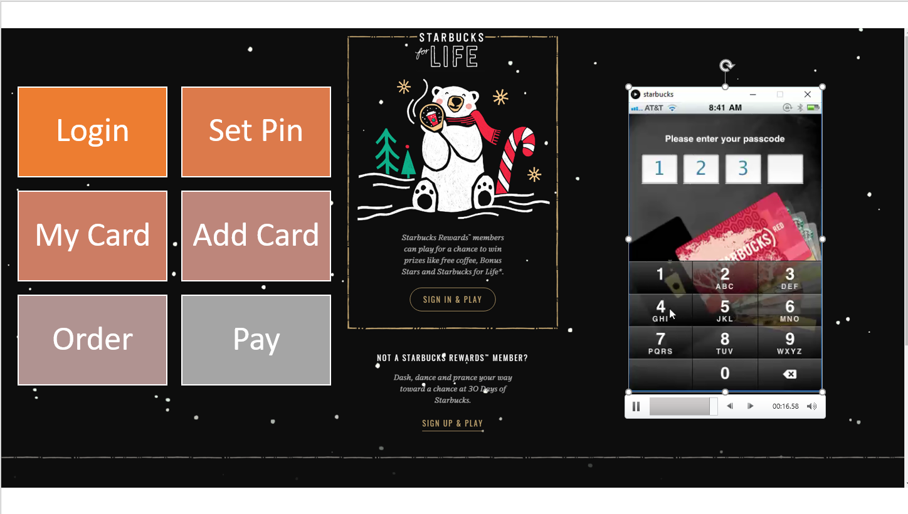

# CMPE 202 - Project - Team Hackathon

- Perform **Project Demo**

- - Present your **UML Diagrams** and **Final Scrum Board / Google Sheet** in a Slide deck
  - Give a demo of your teams working prototype on "Demo Day"
  - Develop a **1-minute "Ad Video" to sell your game**. 
  - **"Ad Video"** will be played in class on "Demo Day".
    Make video available on You Tube.

https://github.com/nguyensjsu/fa18-202-mystic/blob/master/6.ProjectDemo/Mystic.pptx

