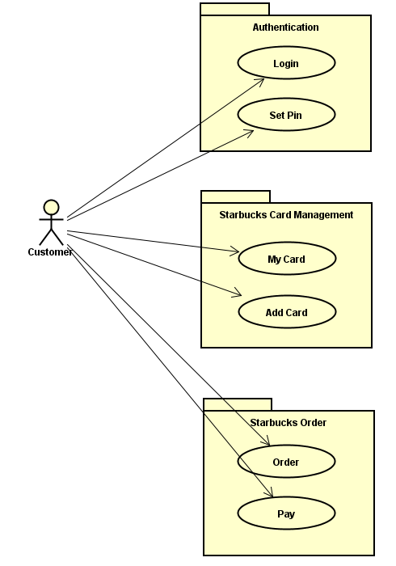
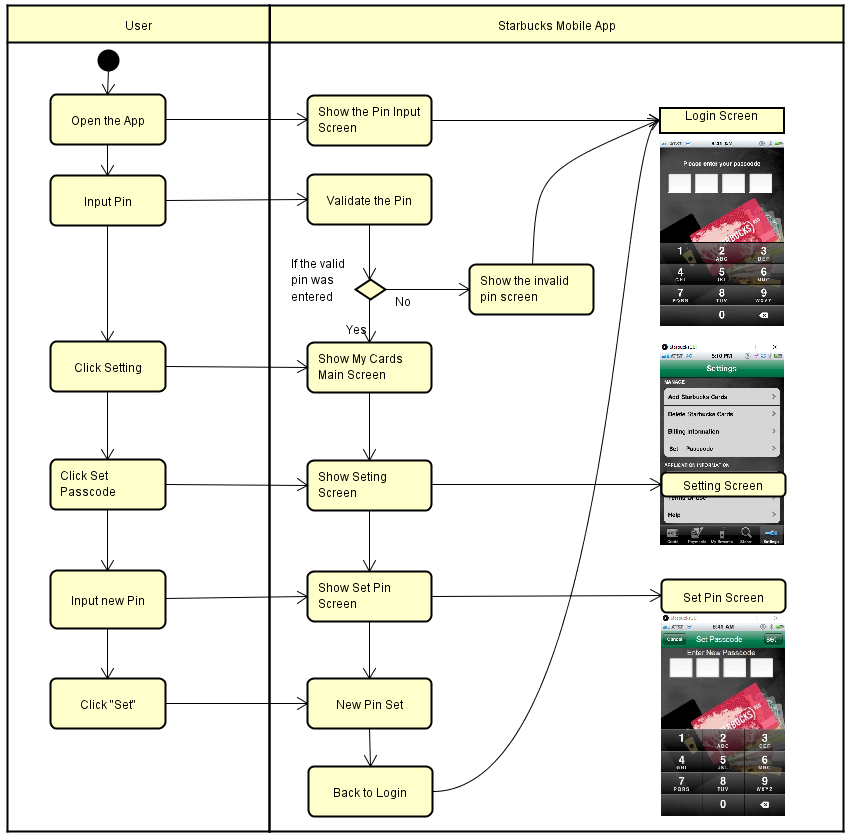
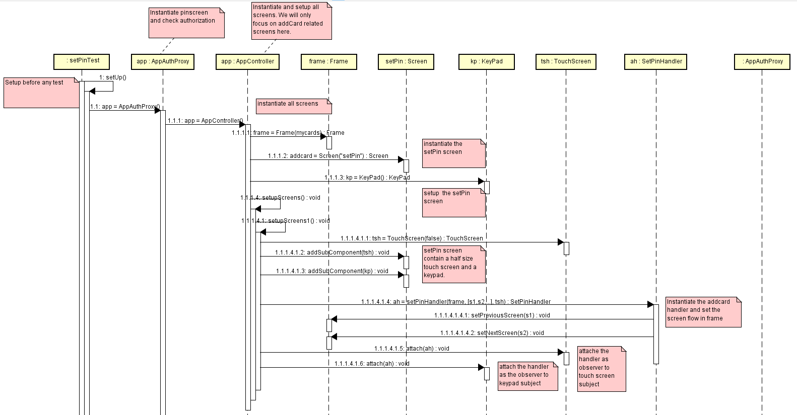
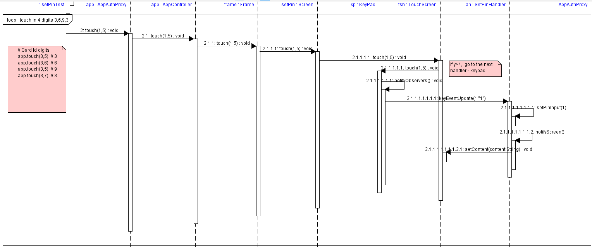
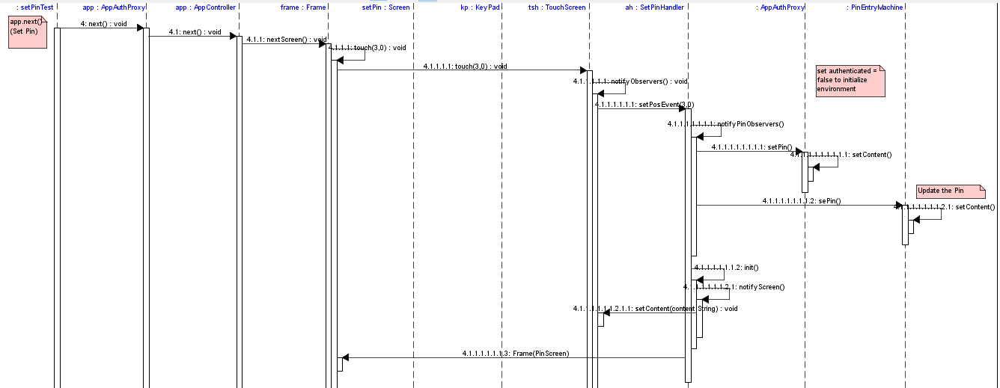
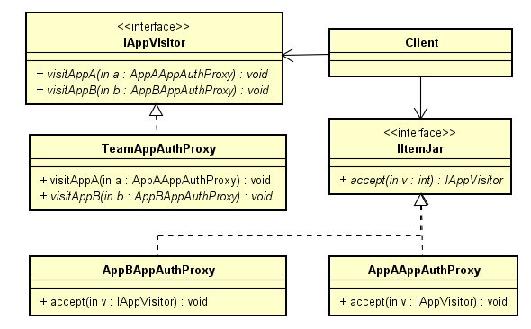

# CMPE 202 - Team Project - Starbuck Mobile App on Processing

The idea is to leverage the individual project implementation and re-build the Starbuck Mobile App on processing with animation UI. 

Download and install the Processing. https://processing.org/

References:
- Sample code from professor. https://github.com/paulnguyen/cmpe202/tree/master/processing
- Java Programming with Processing from professor. https://slack-files.com/files-pri-safe/T0AMW0A3S-FE1PXQENB/java_programming_with_processing.pdf?c=1542777253-18a17676a94dbe8e972df65fdb4a86d335ebf835
- Processing official website.   https://processing.org/

Development environment setup instruction (Updated to V2 at November 26, 2018)

    1) Download the jar files here: 
    - https://github.com/nguyensjsu/fa18-202-mystic/tree/master/5.SourceCode/StarbucksGUI/lib/starbucks.jar
    - https://github.com/nguyensjsu/fa18-202-mystic/tree/master/5.SourceCode/StarbucksGUI/lib/starbucksyh.jar
    
    2) Put the jar files to the processing lib folder , such as: - -
    - processing\modes\java\libraries\starbucks\library\starbucks.jar
    - processing\modes\java\libraries\starbucksyh\library\starbucksyh.jar
    
    3) Restart the process IDE
    
    4) Import the lib into processing
    
    5) Download the project from here: https://github.com/nguyensjsu/fa18-202-mystic/tree/master/5.SourceCode/StarbucksGUI
    
    6) Start to update the starbucksGUI.pde for existing screens and commit the changes

Additional Pattern Implementation - Processing Part

    1) Get the above environment setup done
    2) Implement the additional pattern on java file, compile and build as a jar file
    3) Upload the jar file to the lib folder, for example: 
    - https://github.com/nguyensjsu/fa18-202-mystic/tree/master/5.SourceCode/StarbucksGUI/lib/starbucksyh.jar
    4) Put the jar file to the processing folder, for example:
    - processing\modes\java\libraries\starbucksyh\library\starbucksyh.jar
    5) Restart the process IDE
    6) Import the lib into processing
    7) Update the starbucksGUI.pde for new screens and new patterns
    8) Please update the development environment instruction once you have added a new jar file and notify the team to rebase

Additional Pattern Implementation - Build the jar file

    1) Update the prof starbuck package name to self name, such as starbuckYH;
       You can use notepad++ to "replace in files" to replace "package starbuck" to "package starbuckXX", such as "package starbuckYH"
       change the folder name src->main->java->starbuck  to src->main->java->starbuckYH
                              src->test->java->starbuck  to src->test->java->starbuckYH
    2) Re-import the project into eclipse. you will see all your src code package will change to self name.
    3) Update AppSuthProxy.java, set public to "public boolean authenticated = false ;". It is used for team member jar auth status update.
    4) In the build.gradle file, change baseName = 'starbucks' to baseName = 'starbucksYH'
       In the settings.gradle, change rootProject.name = 'starbucksYH'
    5) Using the original "gradlew jar" to build your jar file

**Activity Diagram**

## Use Case Diagram

## System Sequence Diagrams 

### Login and Set Pin

## Sequence Diagram of Set Pin - Observer Pattern

#### Initial Setup

#### Set Pin Key Input

#### Set Pin 

## Class Diagram

#### Order- Builder Pattern

-----------------------------------
## Journal Week #1 - 11/02 to 11/08
-----------------------------------

### Login Function (Yinghua Qin)

What I have done this week

- I started from looking at some examples of the Processing. 
- Building UI and annimation on processing seems simple. 
- Showcase for week 1

What I plan to do next week

- How to import my individual project Java files to Processing so that I could reuse the source code? 
- Which design patterns I should implement on Login function? The state machine? The observation? Those are implemented on the individual project. 
- Would it be cool to create a QR code scan for login on Processing? It seems there is a QR code scan lib avaiable. 
- Would it be cool to add sound when login fail and a happy sound when login success? 

### Feasibilty experiments in Processing (Thol Chidambaram)

What I have done this week

- Implemented examples in processing for loading images. 
- Added default screenshots from new Starbucks app, rendered them in processing.
- Modified the images to match the same functionaliy in Starbucks requirements pdf.
- Try out rendering live Google map loading for Starbucks stores.
- Showcase for week 1.

What I plan to do next week

- Get all screens ready to match the functionality in requirements.
- Is it possible to use eclipse for IDE instead of using Processing?
- Check the possibility of Features IDE modeling using AspectJ for feature selection.
- How should I implement MyCards page to MyCardsOptions navigations? which pattern should I use?

### XP Core Value - Communication
I have facilitated continuous and constant communiation through out week 1. List of initiatives I did to keep up the core value of communication are the following. 
- Communicated with the team about the capabilities of Processing. 
- Send out the design for store display in processing. 
- Initiated a Whatsapp group discussion. 
- Setup a zoom meeting and gave a demo on processing and stores display.

### AddCard Functionality (Srivatsa Mulpuri)

What I have done this week

- I went through the Processing tutorial online and examples on cmpe202 github
- Created shapes and GUI elements like buttons using processing

What will I do do next week?

- Integrate the personal project source code for Settings and Add Card Functionalities
- Create Buttons in Settings screen for a better user experience
- Implement the screen redirection functionality from settings to AddCard

### Experimenting with Processing (Vidhi)

Work Done:

- Finalized the design for the project
- Divided the tasks
- worked on Proceesing tutorials like image loading, mouse and key press events 

To do:

- Implemening MyCards and MyCardsPay screens
- Adding events to the buttons on the screen
- Merging Java and processing code

### Processing Tutorial and Pattern Use (Mitesh Kumar):

Completed Tasks:
- Tutorials and used examples on Processing.
- Tried importing starbucks images. Read on how to import project in Processing.
- Explored using key buttons in Processing.

Tasks for Next Week:
- Coming up with MyCardsMoreOptions screen import.
- Implement balance functionality in MyCardsMoreOptions in Processing.
- Desing Pattern Trials for login screen and Payments.

-----------------------------------
## Journal Week #2 - 11/09 to 11/15
-----------------------------------

### Login Function (Yinghua Qin)

What I have done this week

- Imported the individaul project Java files to Processing
- Built a login UI with a pre-set PIN 1234
- Tested the login success case - input 1234 (use mouse click)
- Tested the login fail case - input wrong pin (use mouse click)
- Tested the "x" cancel last input chat
- Created a video recording for the showcase

What I plan to do next week

- Implement the design pattern on Login function
- Link with the starbuck source code for screen flow

### MyCards Functionality (Thol Chidambaram)

What I have done this week

- Completed implementing the processing code in eclipse.
- Ingegrated existing starbucks code along with projcessing's "core.jar"
- Started wireframing on coordinate conversion between the new and old Starbucks app screens.
- Completed creating new screen designs.
- Enabled gradle to download and test processing jar files during project compile.

What I'm blocked

- Login screen implementation from Yinghua

What I plan to do next week

- Discuss with team on where they stand
- Complete the entire app functionality in processing.

### XP Core Value - Communication
Keeping up the core value of "Communication", I performed the following actions for the team:
- Setup meetings with team
- Communicated possible design options with the team
- Discussed user stories suitable for pattern implemenation

### AddCard Functionality (Srivatsa Mulpuri)

What I have done this week

- I have integrated the source code for settings and Add card functionalities
- Designed 'Add Starbucks Cards' button on settings screen, implemented onhover and onClick events
- Successfully implemented screen redirection functionality from settings to AddCard
- Showcase for week 2

What will I do do next week?

- Check if can reuse the starbucks personal project source code completely for add card. if not, identify the necessary modifications
- Create fields for cardnumber and cvv code using processing
- Write logic to convert keypad touch event to starbucks app touch event 

### MyCards/MyCardsPay Screen (Vidhi)

Work Done:

- Modified screen image's in accordance to the requirement
- Implemented MyCards and MyCardsPay screens
- Added events to the buttons on the screen
- Merged Java and processing code

To do:

- Adding the wow factor, trying to adding "Feature Model"
- Testing the complete flow

### MyCardsMoreOptions in Processing (Mitesh Kumar)

What I have done this week

- Implemented MyCardsMoreOptions functionality in Processing.
- Modified Images to take care of balance display.
- Debugged code to fix some hang bugs.

What I plan to do next week

- Come up with some ideas to enhance functionality.
- Use Patterns for new functionality.
- Go over 4 pin / 6pin functionality for login.

-----------------------------------
## Journal Week #3 - 11/16 to 11/22
-----------------------------------

### Login Function (Yinghua Qin)

What I have done this week
- I found a way to use the .jar file in processing. 
- With this, I could put all my personal project java code into a jar file and use it in this team project. 
- Instruction: 

      Put the starbucks.jar into the library folder under Processing software.
      processing\modes\java\libraries\starbucks\library\starbucks.jar
      Import the library to the project. 

- I got all the screens from professor's PDF of personal project
- I worked out the size of the screen and the position mapping as listed on the PDF.
  ​    
  ​    The height should same as the 500 in the size function
  ​    
  ​    int headerHeight=60;
  ​    int h=headerHeight+55*8;  //before:480; now: 500
  ​    

      size(320,500);  //480

- Showcase for week 3

What I plan to do next week
- Think about some wow factors to add into the project
- Work with the team to get all screens implemented

### Design pattern selection (Thol Chidambaram)

What I have done this week

- Design use case diagram for UI selection user story
- Implement classes required for design pattern
- Discussed with the team and picked up Strategy/Adapter pattern for implementation
- Modified the screens as per the co-ordinates required by the starbucks app.
- Integrate the changes with the other team members code

What I plan to do next week

- Review the code
- Implement missing functionality
- update documentation
- Check team members on where do they stand
- prepare for submission

### XP Core Value - Communication
At the crucial stage of the project clear communication is very importatant, team improved the communication in following ways.
- Zoom meeting every other day
- Private project group message in slack
- Project integration meetings
- In person xterme programming

### AddCard Functionality (Srivatsa Mulpuri)

What I have done this week

- Developed Add Card functionality using starbucks personal project source code
- Created font for card number and cvv
- Made code changes to display carrd number and cvv in the appropriate fields
- Add Card showcase version 1.0

What will I do do next week?

- Come up with ideas to improve user experience
- Work with team members and integrate the code

### MyCards/MyCardsPay Screen, Faeture Model (Vidhi)

Work Done: 

- Did required filtering  MyCards and MyCardsPay 
- Learnt to convert processing files into java code and implementing processing into ecplise (by adding processing jar's)
- Tried to add feature model but was not successful(I was not able to merge the processing jar and the aspect jar's and run the complete project as a whole)

To do:

- Create Ad youtube video
- Implement Builder Pattern for order 
- Create a  screen for order
- Adding events to the order screen 
- Documentation

### MyCardsMoreOptions Screen, New Functionality  (Mitesh Kumar)

Completed Tasks:
- Refined code to take care of balance in Processing.
- Implemented State Pattern to take care of 4,6 and 0 pin in Login Screen.
- Tried to come up with new functionality on Login.

To Do Next Week:
- Work with team memebers to merge code.
- Create 6 digit pin screen.
- Create Class Diagram for 6 digit pin entry.

-----------------------------------
## Journal Week #4 - 11/23 to 11/30
-----------------------------------

### Login Function and Set Pin Function (Yinghua Qin)

What I have done this week
- Implemented a "Set Pin" with Observer design pattern
- Implemented the multiple app Visitor design pattern

##### Set Pin Showcase

What will I do next week?

- As this is the final sprint so there is no next week. 
- There must be some feedback from the review and we might enhance it based on the feedback. 

### Order feature(Builder Pattern, Screen), Video, Documentation (Vidhi)
To do:
- Working on Builder pattern
- designing order screen
- Video
- Documentation

### 6 pin Screen Functionality, Documentation (Mitesh Kumar)

Completed Tasks:
- Documentation, Reports
- Worked on State Pattern Implementation for 6 pins.
